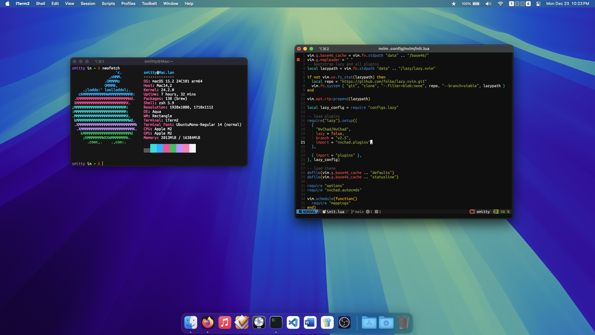

# macos-config
this is my list of macos apps and settings that are required to make macos work well with my (or any productive persons) workflow.


*last updated november 27, 2024*

## table of contents

1. [basic configuration](#basic-configuration)
2. [apps](#full-list-of-apps)
3. [vscode configuration](#vscode)
4. [firefox configuration](#firefox)

## basic configuration
you will need [alttab](https://github.com/lwouis/alt-tab-macos), [firefox](https://www.mozilla.org/en-US/firefox/), and [rectangle](https://github.com/rxhanson/Rectangle). these are necessities

next, i always hide the dock automatticaly because its wasted screen realestate. the animation to show is super slow though so use this command to make the animation faster.

```
defaults write com.apple.dock autohide-time-modifier -float 0.15; killall Dock
```

i dont personally use desktop wallpapers, but do whatever you want.

## full list of apps
[alttab](https://github.com/lwouis/alt-tab-macos) - a funcitonal CMD+Tab menu.
```brew install alttab```

[bartender](https://www.macbartender.com/Bartender5/) - hide elements on menu bar
```brew install bartender```

[firefox](https://www.mozilla.org/en-US/firefox/) - web browser
```brew install firefox```

[iterm2](https://github.com/gnachman/iTerm2) - better terminal (terminal.app has weak color support) ([my config](iterm.json))
```brew install iterm2```

[karabiner-elements](https://github.com/pqrs-org/Karabiner-Elements) - keyboard remaps (remap f3 => launchpad)
```brew install karabiner-elemets```

[linearmouse](https://github.com/linearmouse/linearmouse) - scrolling direction on mouse vs trackpad
```brew install linearmouse```

[monitorcontrol](https://github.com/MonitorControl/MonitorControl) - dim external displays
```brew install monitorcontrol```

[mpv](https://github.com/mpv-player/mpv) - great video player
```brew install mpv```

[oh-my-zsh](https://github.com/ohmyzsh/ohmyzsh) - easy terminal customization ([my config](.zshrc))

[pyenv](https://github.com/pyenv/pyenv?tab=readme-ov-file#macos) - python version control because macos ships with outdated python
```brew install pyenv```

[rectangle](https://github.com/rxhanson/Rectangle) - window snapping + keybinds
```brew install rectangle```

[spaceid](https://github.com/dshnkao/SpaceId) - show which space you are in on the menu bar
```brew install spaceid```

[vscode](https://code.visualstudio.com/) - my code editor of choice
```brew install visual-studio-code```

## vscode
i would use neovim, or really anything else if getting a LSP to work was not such a pain. 

theme: [macos modern theme](https://marketplace.visualstudio.com/items?itemName=davidbwaters.macos-modern-theme&ssr=false#review-details)

*i would reccomend turning on cursor smooth caret animation, it looks really nice, especially on a high refresh rate screen*

extensions
1. [vim](https://marketplace.visualstudio.com/items?itemName=vscodevim.vim)
i set the status bar color control to true so it is more obvious what mode i am in. also turn on relative line numbers, its very helpful.
2. [extension pack for java](https://marketplace.visualstudio.com/items?itemName=vscjava.vscode-java-pack)
this is only necessary if you do java development.

## firefox
i only use firefox because google dosent need any more control over my life. 

theme: [black (mac)](https://addons.mozilla.org/en-US/firefox/addon/black-mac/)

extensions
1. [adblock plus](https://addons.mozilla.org/en-US/firefox/addon/adblock-plus/)
2. [vimium](https://addons.mozilla.org/en-US/firefox/addon/vimium-ff/)
this is legit the best thing ever made. saves a ton of mouse movement with the ```f``` key.
3. [sponsorblock](https://addons.mozilla.org/en-US/firefox/addon/sponsorblock/)
