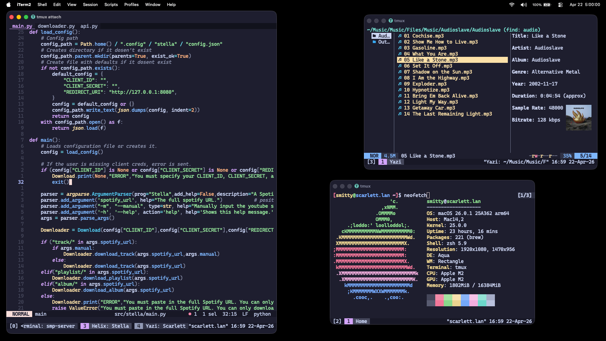

# My MacOS setup and configuration (v3)

This is my personal configuration for macos, and a common list of my favorite
applications and their configurations

(to see my old v2 setup, [click here](./assets/v2.md))

**Last Modified:** April 28, 2026



## Table of contents

<!--toc:start-->
- [My MacOS setup and configuration (v3)](#my-macos-setup-and-configuration-v3)
  - [Table of contents](#table-of-contents)
  - [Apps](#apps)
    - [Browser - Chrome](#browser-chrome)
    - [Terminal - iTerm2](#terminal-iterm2)
    - [Keyboard Shortcuts - skhd](#keyboard-shortcuts-skhd)
    - [Window Management - Rectangle](#window-management-rectangle)
    - [Editor - Helix](#editor-helix)
  - [Terminal Commands](#terminal-commands)
    - [Resetting the Launchpad](#resetting-the-launchpad)
    - [Delete DS_Store Files](#delete-dsstore-files)
    - [Fix Phone Syncing](#fix-phone-syncing)
    - [Reset Login Items Database](#reset-login-items-database)
    - [Hiding menu bar shortcuts](#hiding-menu-bar-shortcuts)
    - [Faster dock animation speed](#faster-dock-animation-speed)
    - [Converting from flac to alac](#converting-from-flac-to-alac)
    - [Yt-dlp download at 720p](#yt-dlp-download-at-720p)
    - [Reset airplay](#reset-airplay)
    - [Uninstall all python packages](#uninstall-all-python-packages)
    - [Drag apps from anywhere](#drag-apps-from-anywhere)
<!--toc:end-->

## Apps

Here are some of my most used apps

### Browser - Chrome

I used to use [Zen](https://zen-browser.app/) alot, but I've come to hate
Firefox's developer tools. If you care about privacy, use
[Librewolf](https://librewolf.net/)

### Terminal - iTerm2

I use [iTerm2](https://iterm2.com/) because it has a pretty easy setup.

- **Theme/Color Scheme:**
  [Catppuccin theme for iTerm2](https://github.com/catppuccin/iterm).
- **Font:** CaskaydiaCove Nerd Font Mono, Regular, 16

### Keyboard Shortcuts - skhd

[skhd](https://github.com/koekeishiya/skhd) is a great hotkey daemon. Better
than most and easy configuration.

### Window Management - Rectangle

[Rectangle](https://rectangleapp.com/) is amazing. Much, much, much better than
macos's version of window management. One day I will learn yabai.

### Editor - Helix

[Helix](https://helix-editor.com/) is the best text editor ever. Setup is simple
and easy. Transition from neovim was easy, and lsp support is easy aswell.

Just be careful, once you start using it, its hard to stop.

- **Theme**: catppuccin_mocha

All configuration can be found in this repo.

## Terminal Commands

### Resetting the Launchpad

This command will reset the launchpad. **This command does not work on
macos26.**

`sudo find 2>/dev/null /private/var/folders/ -type d -name com.apple.dock.launchpad -exec rm -rf {} +; killall Dock`

### Delete DS_Store Files

This command will delete all .DS_Store files recursively

`find . -name ".DS_Store" -delete`

### Fix Phone Syncing

If syncing a iPod or iPhone and it gets stuck on "Preparing to sync", run this
command. It will kill the unresponsive progress and continue the sync.

`pkill -9 "MDCrashReportTool"`

### Reset Login Items Database

This gets rid of old apps that have been uninstalled from the login items menu.

`sfltool resetbtm`

### Hiding menu bar shortcuts

These applescripts will hide/show the menu bar. You can put these into the
shortcuts app to bind them to keyboard shortcuts, or use automater.

To hide the menubar:

```
tell application "System Events"
	tell dock preferences
		set autohide menu bar to true
	end tell
end tell
```

To show the menubar:

```
tell application "System Events"
	tell dock preferences
		set autohide menu bar to false
	end tell
end tell
```

### Faster dock animation speed

This reduces the animation time when hovering to make the dock appear.

`defaults write com.apple.dock autohide-time-modifier -float 0.15; killall Dock`

### Converting from flac to alac

This is great for slsk files when using iTunes/Music.app

```
export IFS=$'\n'
for x in `ls *.flac`; do afconvert -v -f m4af -d alac $x ${x%flac}m4a; done
```

### Yt-dlp download at 720p

Add the following to make the download 720p

```
-S vcodec:h264,fps,res:720,acodec:m4a
```

### Reset airplay

When my airplay isn't working I run this command

```
sudo ifconfig awdl0 down;sudo ifconfig awdl0 up;
```

### Uninstall all python packages

This is more obscure, but I have found it useful.

```
pip freeze | xargs pip uninstall -y
```

### Drag apps from anywhere

I use this very frequently. By holding `cmd` and `ctrl`, you can drag a window from any point without having to drag from the top bar.

```
defaults write -g NSWindowShouldDragOnGesture -bool true
```
