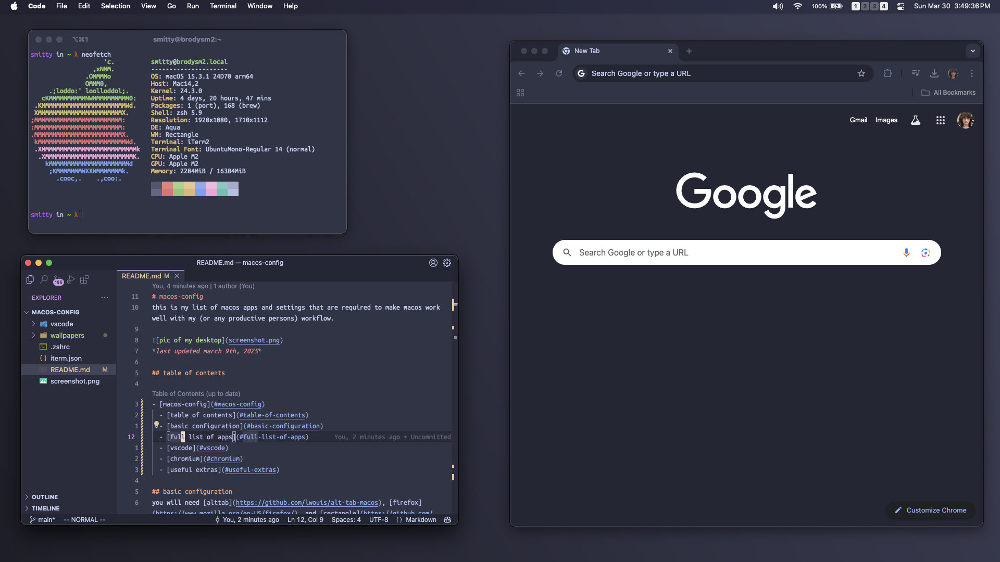

# macos-config
this is my list of macos apps and settings that are required to make macos work well with my (or any productive persons) workflow.


*last updated march 9th, 2025*

## table of contents

1. [basic configuration](#basic-configuration)
2. [apps](#full-list-of-apps)
3. [vscode configuration](#vscode)
4. [chromium configuration](#chromium)
5. [useful extras](#useful-extras)

## basic configuration
you will need [alttab](https://github.com/lwouis/alt-tab-macos), [firefox](https://www.mozilla.org/en-US/firefox/), and [rectangle](https://github.com/rxhanson/Rectangle). these are necessities

next, i always hide the dock automatticaly because its wasted screen realestate. the animation to show is super slow though so use this command to make the animation faster.

```
defaults write com.apple.dock autohide-time-modifier -float 0.15; killall Dock
```

i dont personally use desktop wallpapers, but do whatever you want.

## full list of apps

[bartender](https://www.macbartender.com/Bartender5/) - hide elements on menu bar
```brew install bartender```

[chromium](https://www.chromium.org/chromium-projects/) - web browser
```brew install chromium```

[iterm2](https://github.com/gnachman/iTerm2) - better terminal (terminal.app has weak color support) ([my config](iterm.json))
```brew install iterm2```

[karabiner-elements](https://github.com/pqrs-org/Karabiner-Elements) - keyboard remaps (remap f3 => launchpad)
```brew install karabiner-elemets```

[monitorcontrol](https://github.com/MonitorControl/MonitorControl) - dim external displays
```brew install monitorcontrol```

[mpv](https://github.com/mpv-player/mpv) - great video player
```brew install mpv```

[oh-my-zsh](https://github.com/ohmyzsh/ohmyzsh) - easy terminal customization ([my config](.zshrc))

[pyenv](https://github.com/pyenv/pyenv?tab=readme-ov-file#macos) - python version control because macos ships with outdated python
```brew install pyenv```

[rectangle](https://github.com/rxhanson/Rectangle) - window snapping + keybinds
```brew install rectangle```

[scroll-reverser](https://github.com/pilotmoon/Scroll-Reverser) - reverses scrolling on macos
```brew install scroll-reverser```

[spaceid](https://github.com/dshnkao/SpaceId) - show which space you are in on the menu bar
```brew install spaceid```

[vscode](https://code.visualstudio.com/) - my code editor of choice
```brew install visual-studio-code```

## vscode
i would use neovim, or really anything else if getting a LSP to work was not such a pain. 

theme: [JetBrains Fleet Dark - Fleet Palenight](https://marketplace.visualstudio.com/items?itemName=FranzGollhammer.jb-fleet-dark)

my settings.json file is located [here](/vscode/settings.json)

*i would recommend turning on cursor smooth caret animation, it looks really nice, especially on a high refresh rate screen*

extensions
1. [vim](https://marketplace.visualstudio.com/items?itemName=vscodevim.vim) - i set the status bar color control to true so it is more obvious what mode i am in. also turn on relative line numbers, its very helpful.

## chromium
i used to only use firefox because google dosent need any more control over my life. i gave up.
ungoogled-chromium was too much work to make work, so i just use chromium. it does what i need it to do and nothing more.

theme: default dark

extentions
1. [ublock](https://chromewebstore.google.com/detail/ublock/epcnnfbjfcgphgdmggkamkmgojdagdnn) - okayish ad blocker.
2. [vimium](https://vimium.github.io/) - best thing ever made. 

## useful extras

This command will reset your launchpad. In sequoia the old one does not work. This came in handy for me.
```
sudo find 2>/dev/null /private/var/folders/ -type d -name com.apple.dock.launchpad -exec rm -rf {} +; killall Dock
```

